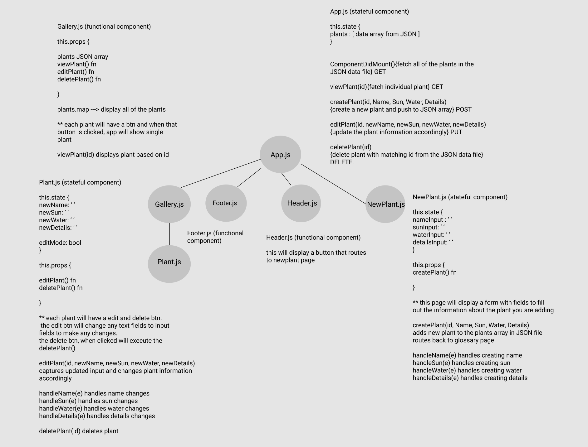
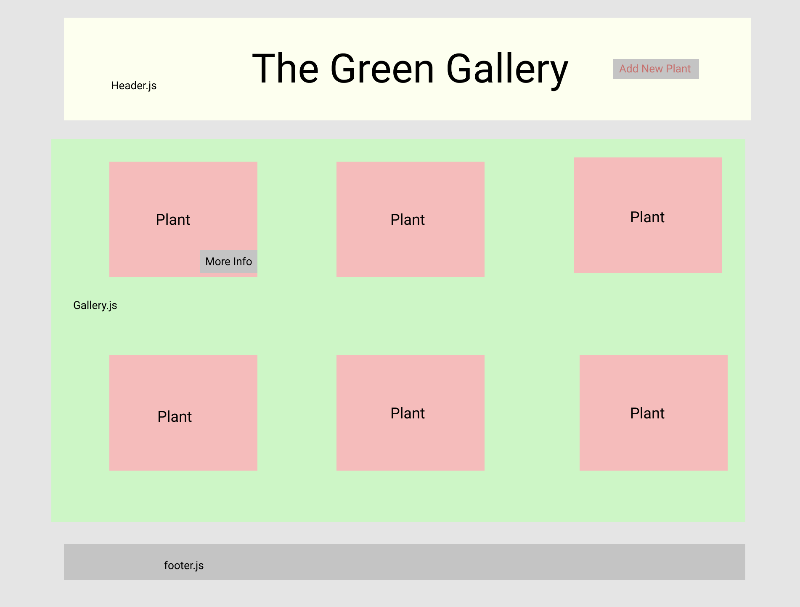
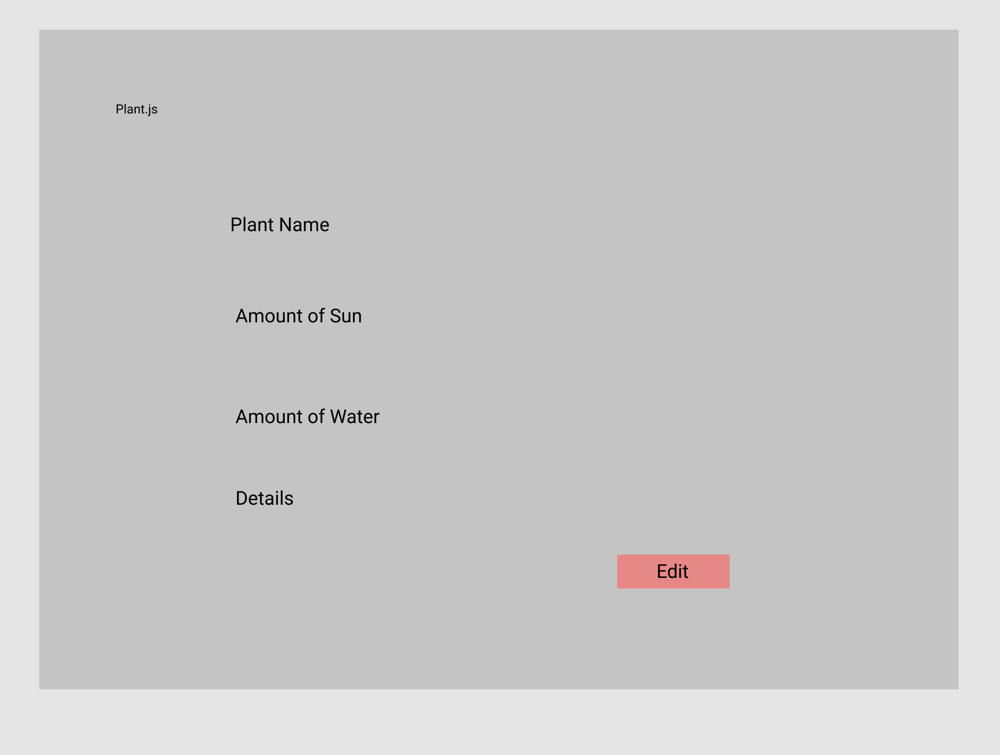
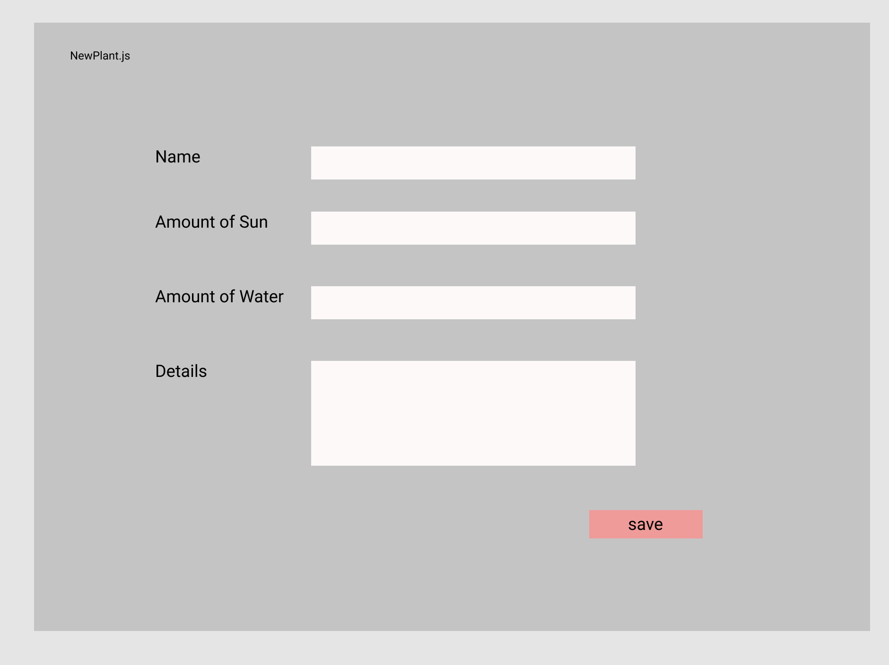

# The Green Gallery

## App Concept
- this is a plant gallery app
- i'll be utilizing a JSON file for the plant data

FULL CRUD
    - GET: get all plants
    - POST: push new plant to plants array in JSON file
    - PUT: edit plant details
    - DELETE: remove plant from plants array in JSON file

## Functionality
- Header at the top of the page with app name and button to click to create a new plant
- Upon clicking create new plant the page will route to NewPlant.js form will display with fields to enter info about the plant and save that information. Upon save, the newly added plant will appear in the gallery.
- Upon app loading there will be 3-5 hard coded plants shown on the gallery page from the plants array in the JSON file
- Each plant will have a picture and preview of the plant descrption. There will also be a button 'more info' for each plant
- When the 'more info' button is clicked the app will route and display a Plant page of that individual plant selected and the full information about that plant (picture, water amount, sun amount, description)
- The Plant page will have a back button, that'll take you back to the gallery of plants
- The plant page will also have an edit button which will change the text fields to input fields upon clicking. This will also cause a back (take you out of edit mode) and save (save the changes you are editing) button to appear.

## Endpoints 
- GET: fetch all plants in the plants array from the JSON file
- GET: fetch individual plant based on id
- POST: push a new plant to plants array in the JSON file
- PUT: update individual plant details
- DELETE: remove individual plant from plants array in the JSON file

## Component Architecture 
- App.js (stateful component)
    - Header.js (stateful component)
        - NewPlant.js (stateful component)
    - Gallery.js(stateful component)
        - Plant.js(stateful component)
    - Footer.js (functional component)

## Wireframe

